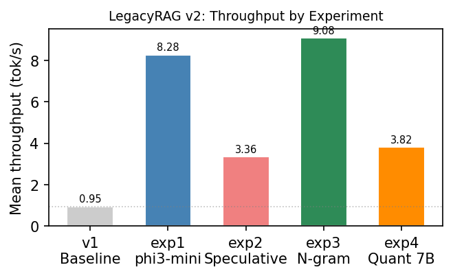

# LegacyRAG v2 — Speculative Decoding & Quantization Benchmarks on Legacy Vulkan Hardware

[](LICENSE)
[](https://www.python.org/)
[](https://conferences.computer.org/IC2E/)

> **Target venue:** IEEE International Conference on Cloud Engineering (IC2E) 2026 — Demo Paper

---

## What It Does

LegacyRAG v2 is a **reproducible benchmark suite** evaluating speculative decoding and aggressive quantization for LLM inference on Maxwell-generation Vulkan hardware. The experiments characterize whether these standard throughput optimizations transfer to hardware lacking FP16 matrix acceleration and tensor cores.

**Research question:** On hardware without FP16 or tensor cores — where all matrix arithmetic executes in FP32 — do speculative decoding or aggressive quantization improve inference throughput for an edge RAG pipeline?

**Primary finding:** Neither technique yields a throughput gain on this hardware class. N-gram speculative decoding (+10%) is the sole exception, as it introduces no VRAM overhead and imposes no parallel verification requirement.

---

## Hardware Target

| Component | Spec |
|---|---|
| GPU | 2x NVIDIA Quadro K4200 |
| VRAM | 4 GB GDDR5 per card |
| Architecture | Maxwell GM204 (2014), no FP16, no tensor cores |
| Memory bandwidth | 173 GB/s per card |
| Inference backend | llama.cpp b9297 + Vulkan 1.3 |
| LLM | phi3:mini (3.8B, Q4_K_M) |
| Embedding model | nomic-embed-text via Ollama |

---

## Key Features

- **4 standalone benchmark experiments** — each Python script is self-contained and re-runnable
- **`benchmark_runner.py`** — orchestrates all 4 experiments sequentially, writes structured JSON to `results/`
- **Controlled comparison** — all experiments run against the same hardware, same Vulkan backend, same prompt corpus
- **Negative results documented** — v2 reports all non-improving configurations with mechanistic explanations of root cause
- **Builds on v1 baseline** — v1 measured 0.95 tok/s; v2 baseline (Exp 1) measures 8.278 tok/s after llama.cpp backend upgrade, giving a 771% improvement as the new reference point
- **Analysis module** — `analysis.py` generates comparison tables and summary statistics from the `results/` directory

---

## Benchmark Results

### Summary Table

| Experiment | Model | Mean tok/s | vs v1 baseline | vs Exp 1 |
|---|---|---|---|---|
| v1 Baseline (reference) | phi3:mini | 0.95 | — | — |
| **Exp 1: phi3:mini baseline (v2)** | phi3:mini Q4_K_M | **8.278** | +771% | — |
| Exp 2: Speculative decoding | qwen2:1.5b + qwen2:0.5b draft | 3.357 | +253% | **−59%** |
| Exp 3: N-gram speculative | ngram-simple | **9.084** | +856% | +10% |
| Exp 4: Quantization 7B | qwen2.5:7b-q2_K | 3.823 | +302% | **−54%** |

### Throughput Comparison



### ASCII Throughput Bar Chart

```
Throughput (tok/s) — all experiments
─────────────────────────────────────────────────────
v1 Baseline  │▌                                          0.95 tok/s
─────────────────────────────────────────────────────
Exp 1        │████████████████████████████████████████  8.278 tok/s
Exp 2        │████████████████                          3.357 tok/s
Exp 3        │█████████████████████████████████████████ 9.084 tok/s  ← best
Exp 4        │██████████████████                        3.823 tok/s
─────────────────────────────────────────────────────
             0          2         4         6         9+ tok/s
```

### Experiment 1 Detail — phi3:mini Baseline by Prompt Length

| Prompt length | Count | Mean tok/s | Wall time |
|---|---|---|---|
| Short | 3 | 8.554 | 25s |
| Medium | 4 | 8.395 | 149s |
| Long | 3 | 7.847 | 405s |

Throughput is stable across prompt lengths — Maxwell's FP32 compute rate is the ceiling, not prompt context size.

### Experiment 2 — Speculative Decoding

- **Draft model:** qwen2:0.5b
- **Target model:** qwen2:1.5b
- **Draft acceptance rate:** 36.86%
- **Throughput:** 3.357 tok/s (−59% vs Exp 1)

### Experiment 3 — N-gram Speculative Decoding

- **Method:** ngram-simple (predict repeated token sequences from recent context)
- **Throughput:** 9.084 tok/s (+9.7% vs Exp 1)
- **Extra VRAM:** 0 MB
- **Extra model:** none

### Experiment 4 — Aggressive Quantization (7B at Q2_K)

- **Model:** qwen2.5:7b at Q2_K
- **Model size on disk:** 2,876 MB
- **Throughput:** 3.823 tok/s (−54% vs phi3:mini baseline)

---

## Performance Degradation Analysis — ASCII Diagrams

### How Speculative Decoding Is Supposed to Work

```
NORMAL AUTOREGRESSIVE DECODING
───────────────────────────────
Step 1: [prompt]         → token_1
Step 2: [prompt, t1]     → token_2
Step 3: [prompt, t1, t2] → token_3
         ... (one step at a time)

SPECULATIVE DECODING (intended)
────────────────────────────────
Draft model (small, fast):
  [prompt] → guess_1, guess_2, guess_3, guess_4  (4 drafts in parallel)

Target model (large):
  [prompt + 4 drafts] → verify all 4 in ONE forward pass ← parallel!

If accepted: 4 tokens for the price of ~1.3 forward passes → speedup
```

### Why It Fails on Maxwell (K4200)

```
WHAT ACTUALLY HAPPENS ON MAXWELL (no FP16, no tensor cores)
─────────────────────────────────────────────────────────────
All matrix operations run in FP32.
"Verify all 4 in one forward pass" still runs 4 sequential FP32 ops.

Draft model:    [K4200] → guess_1 → guess_2 → guess_3 → guess_4
                         (sequential, FP32)

Verification:   [K4200] → check_1 → check_2 → check_3 → check_4
                         (still sequential — no parallel batch support)

Acceptance:     36.86% of drafts accepted → 63% wasted compute

Result: extra overhead from running the draft model, no parallelism benefit
        −59% throughput vs just running the target model directly
```

### Why Aggressive Quantization Doesn't Help

```
QUANTIZATION ASSUMPTION (intended)
───────────────────────────────────
phi3:mini  3.8B params  Q4_K_M  →  fast   ✓
qwen2.5-7B 7B params    Q2_K    →  comparable on-disk size, expected similar speed

WHAT ACTUALLY DETERMINES SPEED ON MAXWELL
───────────────────────────────────────────
Not file size.  Not quantization level.  PARAMETER COUNT.

Each transformer layer requires (params × bytes_per_param) multiply-add ops.
7B at Q2_K still has 7B parameters to process.
Maxwell executes every multiply-add in FP32 regardless of quantization.

phi3:mini  3.8B × FP32 ops = ~15.2 GFLOP per token step
qwen2.5-7B 7.0B × FP32 ops = ~28.0 GFLOP per token step  ← 1.84× more work

Observed: −54% throughput. Quantization cannot undo parameter count.
```

### Why N-gram Speculation Works

```
N-GRAM SPECULATIVE DECODING
─────────────────────────────
Hypothesis: in long, repetitive RAG outputs, the model often
            repeats short phrases verbatim ("The document states...",
            "According to the policy...").

N-gram method:
  1. Maintain a sliding window of recent tokens
  2. Look up the last N tokens in that window as a key
  3. Predict: "next tokens are probably whatever followed this
     pattern before in this same response"
  4. Skip the draft model entirely — no VRAM, no extra forward pass

Verification: same target model forward pass, but proposed tokens
              often match → acceptance rate higher than learned draft

Result: +9.7% throughput with zero additional resource cost
        This is the only technique that actually helps on Maxwell.
```

---

## Technique Evaluation Summary

| Technique | Result | Root cause |
|---|---|---|
| Upgraded llama.cpp backend (b9297 vs b5576) | +771% vs v1 | Better Vulkan dispatch, not new hardware |
| N-gram speculative decoding | +10% | No parallel requirement; pattern matching only |
| Speculative decoding (learned draft) | −59% | Maxwell verifies drafts sequentially in FP32 |
| Aggressive quantization (bigger model, lower bits) | −54% | Parameter count drives FP32 op count; bits don't |
| Dual-GPU layer split (from v1) | −50% prefill | Inter-GPU Vulkan sync overhead dominates prefill |

**Core finding:** On Maxwell-era hardware, the parallelism assumption underlying most LLM acceleration techniques — that verification or batch operations execute concurrently — does not hold. All matrix multiplications are dispatched as sequential FP32 operations. Techniques that introduce additional computational overhead without eliminating sequential steps in this chain reduce net throughput.

---

## Repository File Tree

```
LegacyRAG-v2-experiments/
├── legacyrag_v2/
│   ├── experiment1_baseline.py          # phi3:mini throughput across prompt lengths
│   ├── experiment2_speculative_draft.py # speculative decoding: qwen2 draft model
│   ├── experiment3_ngram.py             # n-gram speculative decoding
│   ├── experiment4_quantization.py      # qwen2.5-7B at Q2_K quantization
│   ├── benchmark_runner.py              # orchestrates all 4 experiments
│   ├── analysis.py                      # post-run table and stats generation
│   └── results/                         # JSON output from each experiment run
│       ├── exp1_baseline.json
│       ├── exp2_speculative.json
│       ├── exp3_ngram.json
│       └── exp4_quantization.json
├── legacyrag/                           # v1 pipeline (reference implementation)
│   ├── vram_scheduler.py
│   ├── embedder.py
│   ├── retriever.py
│   ├── generator.py
│   ├── pipeline.py
│   └── benchmark.py
├── graphs/                              # benchmark visualizations
├── paper_findings.md                    # full v1 research writeup with tables
├── results_table.csv                    # tabular export of v1 benchmark_results.json
├── benchmark_results.json               # v1 per-request benchmark records
├── benchmark_results_baseline.json      # immutable copy of v1 baseline data
├── schedule_decisions.jsonl             # VRAM scheduler decision log (v1)
├── stress_test_results.json             # v1 concurrent load test
├── requirements.txt
├── main.py                              # v1 FastAPI app entry point
└── README.md
```

---

## Setup

### Prerequisites

```bash
# llama.cpp b9297 or later, built with Vulkan backend
# Ollama running on port 11434
ollama pull nomic-embed-text
ollama pull phi3:mini
ollama pull qwen2:1.5b
ollama pull qwen2:0.5b
ollama pull qwen2.5:7b
```

### Install

```bash
git clone https://github.com/azeez-1904/LegacyRAG-v2-experiments.git
cd LegacyRAG-v2-experiments
pip install -r requirements.txt
```

### Run All Experiments

```bash
cd legacyrag_v2
python3 benchmark_runner.py        # runs all 4 experiments sequentially
# results written to results/
```

### Run Individual Experiments

```bash
cd legacyrag_v2
python3 experiment1_baseline.py          # phi3:mini baseline
python3 experiment2_speculative_draft.py # speculative decoding
python3 experiment3_ngram.py             # n-gram speculative
python3 experiment4_quantization.py      # quantization 7B
```

### Analyze Results

```bash
cd legacyrag_v2
python3 analysis.py                # prints comparison tables from results/
```

### llama-server (recommended launch flags for these experiments)

```bash
# Experiments 1, 3 (phi3:mini)
LD_LIBRARY_PATH=build/bin build/bin/llama-server \
  -m /path/to/phi3-mini-q4_k_m.gguf \
  -ngl 99 \
  --port 8080

# Experiment 2 (qwen2:1.5b target)
LD_LIBRARY_PATH=build/bin build/bin/llama-server \
  -m /path/to/qwen2-1.5b.gguf \
  --draft-model /path/to/qwen2-0.5b.gguf \
  -ngl 99 \
  --port 8080

# Experiment 4 (qwen2.5-7B Q2_K)
LD_LIBRARY_PATH=build/bin build/bin/llama-server \
  -m /path/to/qwen2.5-7b-q2_k.gguf \
  -ngl 99 \
  --port 8080
```

---

## Research Context

This project is part of a four-paper series studying inference feasibility on legacy and constrained hardware, targeting IEEE and ACL venues:

### Research Series

| Repo | Description | Venue |
|---|---|---|
| [LegacyRAG v1](https://github.com/azeez-1904/LegacyRAG) | Original VRAM-aware RAG pipeline on K4200; establishes 0.95 tok/s baseline and VRAM scheduler | arXiv 2026 |
| **LegacyRAG v2 (this repo)** | Benchmark suite: speculative decoding + quantization on same hardware | IC2E 2026 |
| [PhaseRAG v3](https://github.com/azeez-1904/PhaseRAG-LegacyRAG-v3) | CPU-GPU phase splitting; builds on v2 finding that GPU-only tricks fail on Maxwell | MLSys 2027 |
| [TemporalRAG](https://github.com/azeez-1904/TemporalRAG) | Version-aware document retrieval; addresses knowledge staleness in long-running edge deployments | ACL 2027 |

**Series progression:**
```
LegacyRAG v1          LegacyRAG v2          PhaseRAG v3           TemporalRAG
(hardware baseline;   (negative results:    (positive result:     (open problem:
 VRAM scheduler)       GPU-only limits)      CPU-GPU phasing)      temporal drift)
     0.95 tok/s  ──►      8.278 tok/s   ──►    improved split  ──►   staleness-aware
```

---

## Citation

If you use LegacyRAG v2 in your research, please cite:

```bibtex
@inproceedings{legacyrag_v2_2026,
  title     = {LegacyRAG v2: Speculative Decoding and Quantization for Edge RAG on Legacy Vulkan Hardware},
  author    = {Ahmad, Azeez},
  booktitle = {IEEE International Conference on Cloud Engineering (IC2E)},
  year      = {2026},
  url       = {https://github.com/azeez-1904/LegacyRAG-v2-experiments}
}
```

For the original VRAM-aware pipeline (v1 baseline):

```bibtex
@misc{legacyrag2026,
  title   = {LegacyRAG: VRAM-Aware Retrieval-Augmented Generation on Legacy GPU Hardware},
  author  = {Ahmad, Azeez},
  year    = {2026},
  url     = {https://github.com/azeez-1904/LegacyRAG}
}
```

---

## License

MIT — see [LICENSE](LICENSE).
